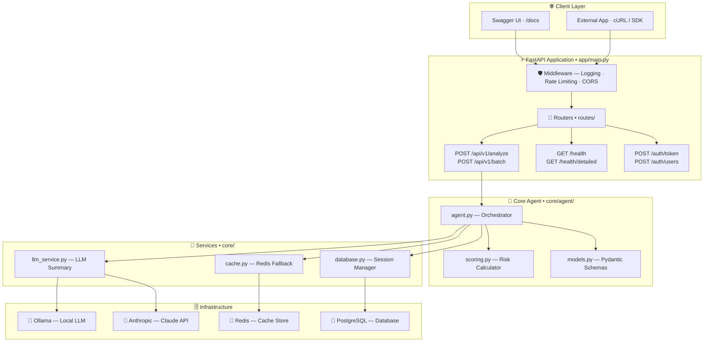
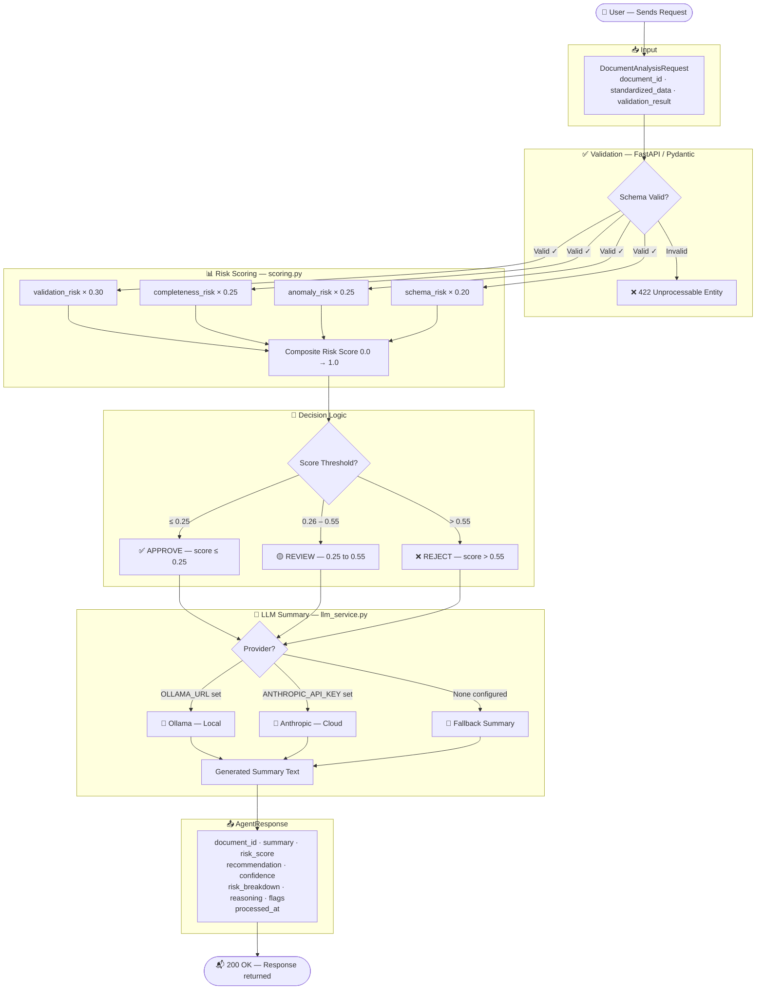
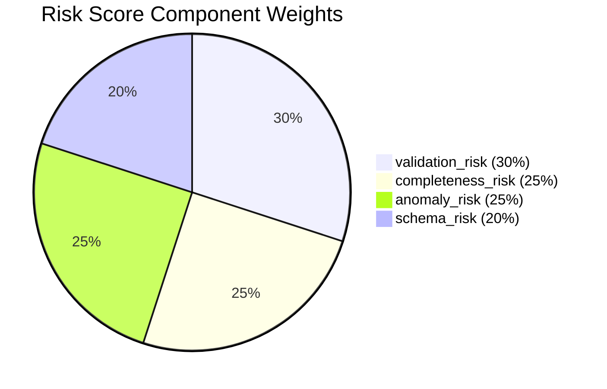

# 🛡️ Risk Agent API

<div align="center">

[](https://www.python.org/downloads/)
[](https://fastapi.tiangolo.com/)
[](https://opensource.org/licenses/MIT)
[](https://github.com/psf/black)
[](https://mypy-lang.org/)

**AI-powered document analysis — risk scoring, LLM summaries, and automated recommendations.**

[Quick Start](#-quick-start) · [API Reference](#-api-reference) · [Architecture](#-architecture) · [Risk Scoring](#-risk-scoring) · [Contributing](#-contributing)

</div>

---

## 📖 Overview

The **Risk Agent API** is a production-ready FastAPI service that accepts standardized document payloads, computes a deterministic risk score, and returns an LLM-generated summary with an automated `approve` / `review` / `reject` recommendation.

| Capability | Description |
|---|---|
| 🎯 **Decision Agent** | Deterministic risk scoring with weighted components |
| 📝 **Summary Agent** | AI-generated summaries via Ollama or Anthropic Claude |
| ⚙️ **Risk Agent** | End-to-end orchestration for single or batch payloads |
| 📦 **Batch Processing** | Up to 20 documents analyzed concurrently |
| 🔒 **Auth** | JWT Bearer + API Key authorization |
| 💚 **Health Checks** | Degraded-mode tolerance for cache/LLM failures |

---

## 📋 Table of Contents

- [Architecture](#-architecture)
- [Document Flow](#-document-flow)
- [Project Structure](#-project-structure)
- [Requirements](#-requirements)
- [Installation](#-installation)
- [Quick Start](#-quick-start)
- [Configuration](#-configuration)
- [API Reference](#-api-reference)
- [Data Models](#-data-models)
- [Risk Scoring](#-risk-scoring)
- [Development](#-development)
- [Testing](#-testing)
- [Deployment](#-deployment)
- [Contributing](#-contributing)
- [License](#-license)

---

## 🏗️ Architecture

The Risk Agent API follows a **modular, layered architecture** with clear separation of concerns across routing, business logic, and infrastructure services.



### Core Components

| Layer | Module | Responsibility |
|---|---|---|
| **Routers** | `routes/rout.py` | HTTP request handling, input validation |
| **Auth** | `routes/auth.py` | JWT token issuance, user management |
| **Agent** | `core/agent/agent.py` | Orchestration of scoring + summary |
| **Scoring** | `core/agent/scoring.py` | Deterministic risk calculation |
| **LLM Service** | `core/llm_service.py` | Ollama / Anthropic integration |
| **Cache** | `core/cache.py` | Redis with graceful fallback |
| **Database** | `core/database.py` | Async session management |

---

## 🔄 Document Flow

Every document submitted to `/api/v1/analyze` travels through this exact pipeline before a response is returned.



---

## 📁 Project Structure

```
risk-agent/
├── run.py                        # 🚀 Entry point — starts Uvicorn
├── pyproject.toml
├── requirements.txt
├── README.md
│
├── app/
│   ├── __init__.py
│   └── main.py                   # FastAPI factory · registers all routers & middleware
│
├── config.py                     # Pydantic settings (env vars)
│
├── core/
│   ├── agent/
│   │   ├── agent.py              # Orchestrates risk analysis
│   │   ├── models.py             # Request / response Pydantic schemas
│   │   └── scoring.py            # Risk score calculation algorithms
│   ├── cache.py                  # Redis abstraction with in-memory fallback
│   ├── database.py               # Async DB session management
│   ├── llm_service.py            # Ollama / Anthropic integration
│   ├── middleware_logging.py     # Structured request logging
│   └── rate_limiting.py          # Rate-limit middleware
│
├── routes/
│   ├── auth.py                   # POST /auth/token · POST /auth/users
│   ├── health.py                 # GET /health · GET /health/detailed
│   └── rout.py                   # POST /api/v1/analyze · POST /api/v1/batch
│
├── services/
│   ├── auth.py                   # JWT helpers
│   └── auth_service.py           # User store & verification
│
├── data/
│   └── risk_agent.json           # Example request payload
│
└── tests/
    ├── conftest.py
    └── test_api.py
```

---

## 📦 Requirements

- **Python** 3.11+
- **Redis** *(optional — health checks degrade gracefully)*
- **PostgreSQL** *(or any async-compatible database)*
- **Ollama** or **Anthropic API key** for LLM summaries

---

## ⚙️ Installation

```bash
# Clone the repo
git clone <repo-url> && cd risk-agent

# Install with pip
pip install -r requirements.txt

# OR with uv (recommended)
uv sync
```

---

## 🚀 Quick Start

```bash
python run.py
# or
uv run python run.py
```

Open **http://127.0.0.1:8000/docs** for the interactive Swagger UI.

### First-time Auth Setup

```bash
# 1. Create a user
curl -X POST http://localhost:8000/auth/users \
  -H "Content-Type: application/json" \
  -d '{"username": "admin", "password": "admin123", "is_admin": true}'

# 2. Get a JWT token
curl -X POST http://localhost:8000/auth/token \
  -d "username=admin&password=admin123"

# 3. Use the token in requests
curl -X POST http://localhost:8000/api/v1/analyze \
  -H "Authorization: Bearer <your-token>" \
  -H "Content-Type: application/json" \
  -d @data/risk_agent.json
```

---

## 🔧 Configuration

| Variable | Default | Description |
|---|---|---|
| `PORT` | `8000` | API server port |
| `UVICORN_RELOAD` | `0` | Set `1` to enable hot reload |
| `OLLAMA_URL` | `http://127.0.0.1:11434` | Local Ollama endpoint |
| `OLLAMA_MODEL` | `llama2` | Ollama model name |
| `ANTHROPIC_API_KEY` | *(not set)* | Anthropic Claude API key |
| `LLM_PROVIDER` | `ollama` | `ollama` or `anthropic` |
| `ENABLE_AUTHENTICATION` | `true` | Enable JWT auth |
| `SECRET_KEY` | *(required)* | JWT signing secret |

---

## 🔌 API Reference

### Authentication

| Method | Endpoint | Description |
|---|---|---|
| `POST` | `/auth/users` | Register a new user |
| `POST` | `/auth/token` | Login — returns JWT access token |
| `GET` | `/auth/users/me` | Get current user info |

### Health

| Method | Endpoint | Description |
|---|---|---|
| `GET` | `/health` | Basic liveness probe |
| `GET` | `/health/detailed` | Checks DB, cache, and LLM dependencies |

### Agent

| Method | Endpoint | Description |
|---|---|---|
| `POST` | `/api/v1/analyze` | Analyze a single document |
| `POST` | `/api/v1/batch` | Analyze up to 20 documents in parallel |

### Example Request — `POST /api/v1/analyze`

```json
{
  "document_id": "DOC001",
  "standardized_data": {
    "document_type": "invoice",
    "issuer": "Acme Corp",
    "amount": 15000.0,
    "currency": "USD",
    "issue_date": "2024-01-15",
    "expiry_date": "2024-04-15",
    "counterparty": "Globex Ltd",
    "jurisdiction": "US",
    "metadata": { "po_number": "PO-9981" }
  },
  "validation_result": {
    "is_valid": true,
    "missing_fields": [],
    "anomalies": [],
    "schema_errors": [],
    "completeness_score": 0.97
  }
}
```

### Example Response

```json
{
  "document_id": "DOC001",
  "summary": "Invoice from Acme Corp for USD 15,000...",
  "risk_score": 0.12,
  "recommendation": "approve",
  "confidence": 0.95,
  "risk_breakdown": {
    "validation_risk": 0.00,
    "completeness_risk": 0.03,
    "anomaly_risk": 0.00,
    "schema_risk": 0.00
  },
  "reasoning": "Document passed all validation checks with high completeness.",
  "flags": [],
  "processed_at": "2024-01-15T10:30:00Z"
}
```

---

## 📐 Data Models

### `DocumentAnalysisRequest`

```python
class DocumentAnalysisRequest(BaseModel):
    document_id: str
    standardized_data: StandardizedData
    validation_result: ValidationResult
```

### `StandardizedData`

```python
class StandardizedData(BaseModel):
    document_type: str          # "invoice", "contract", etc.
    issuer: str
    amount: Optional[float]
    currency: Optional[str]
    issue_date: Optional[str]
    expiry_date: Optional[str]
    counterparty: Optional[str]
    jurisdiction: Optional[str]
    metadata: Dict[str, Any]
```

### `AgentResponse`

```python
class AgentResponse(BaseModel):
    document_id: str
    summary: str
    risk_score: float                                    # 0.0 → 1.0
    recommendation: Literal["approve", "review", "reject"]
    confidence: float                                    # 0.0 → 1.0
    risk_breakdown: RiskBreakdown
    reasoning: str
    flags: List[str]
    processed_at: datetime
```

---

## 📊 Risk Scoring

The composite risk score is a **weighted sum** of four components:



| Component | Weight | Calculation Method |
|---|---|---|
| `validation_risk` | **30%** | `1.0` if invalid · else `missing_fields × 0.1` |
| `completeness_risk` | **25%** | `1.0 − completeness_score` |
| `anomaly_risk` | **25%** | Sigmoid penalty per anomaly count |
| `schema_risk` | **20%** | Linear penalty per schema error |

### Recommendation Thresholds

```
Score  0.0 ──────── 0.25 ──────────────── 0.55 ──────────── 1.0
        │   ✅ APPROVE   │   🟡 REVIEW      │  ❌ REJECT      │
```

| Score Range | Recommendation |
|---|---|
| `0.00 – 0.25` | ✅ `approve` |
| `0.26 – 0.55` | 🟡 `review` |
| `0.56 – 1.00` | ❌ `reject` |

---

## 🛠️ Development

```bash
# Install dev dependencies
uv sync --dev

# Activate virtual environment
source .venv/bin/activate        # Windows: .venv\Scripts\activate

# Run with hot reload
UVICORN_RELOAD=1 python run.py
```

### Code Quality

```bash
ruff check .          # Linting
black .               # Formatting
mypy .                # Type checking
```

---

## 🧪 Testing

```bash
# Run all tests
pytest tests/ -v

# With coverage report
pytest tests/ --cov=core --cov-report=term-missing

# Via uv
uv run pytest
```

---

## 🐳 Deployment

### Docker

```dockerfile
FROM python:3.11-slim
WORKDIR /app
COPY . .
RUN pip install -r requirements.txt
EXPOSE 8000
CMD ["python", "run.py"]
```

```bash
docker build -t risk-agent .
docker run -p 8000:8000 \
  -e ANTHROPIC_API_KEY=your-key \
  -e LLM_PROVIDER=anthropic \
  risk-agent
```

### Production Checklist

- [ ] Set `UVICORN_RELOAD=0`
- [ ] Set a strong `SECRET_KEY` for JWT signing
- [ ] Configure a real PostgreSQL database
- [ ] Set `OLLAMA_URL` or `ANTHROPIC_API_KEY`
- [ ] Use a reverse proxy (nginx / Caddy) for SSL termination
- [ ] Enable structured logging and monitoring

---

## 🤝 Contributing

1. Fork the repository
2. Create a feature branch: `git checkout -b feature/amazing-feature`
3. Write tests first (TDD approach)
4. Implement and document your changes
5. Run the full suite: `pytest && ruff check . && mypy .`
6. Commit: `git commit -m 'feat: add amazing feature'`
7. Push and open a Pull Request

### Code Standards

- PEP 8 + `black` formatting enforced
- Type hints required on all functions
- Docstrings on all public APIs
- Test coverage ≥ 80%

---

## 📄 License

Released under the [MIT License](https://opensource.org/licenses/MIT).

---

<div align="center">
  <sub>Built with ❤️ using FastAPI · Pydantic · Ollama · Anthropic Claude</sub>
</div>
